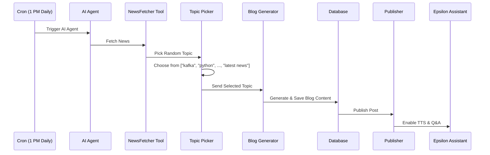

# Jayanth’s Blog Website

A **dynamic blog platform** showcasing Jayanth’s thoughts, tutorials, and tech dives—evolving from a simple static site to a fully AI-powered experience.

---

## 🚀 Tech Stack

* **Frontend:** HTML, CSS, JavaScript, Bootstrap (v1.0–v2.0); React.js (v2.5+)
* **Backend:** Node.js, Express , Fast api 
* **Database:** MongoDB, Mongoose
* **AI & Automation:** LangChain, Google Gemini (Èpsilon agent), Agno AI Agent  

---

## 📖 Table of Contents

1. [About](#about)
2. [Features](#features)
3. [Version History](#version-history)
4. [License](#license)
5. [Contact](#contact)

---

## About

Jayanth’s Blog began as a static HTML/CSS/JavaScript site and has grown into a full-featured application with an admin dashboard, analytics, a portfolio section, automated AI publishing, and a virtual voice assistant **Èpsilon**.

---

## Features

* **Responsive UI:** Static pages → Bootstrap → React components
* **Admin Section:** Secure login; manage blog posts
* **User Dashboard:** Authentication, commenting 
* **Portfolio:** Admin’s education, work/school experience, projects
* **AI Agent (v4.0):** Auto-publishes daily at 1 PM on trending topics
* **Èpsilon Assistant:** In-app TTS summarizer and admin-info helper

---

## Version History

### v1.0.0 – Static Blog

* Pure HTML/CSS/JS with Bootstrap
* Hard-coded posts

### v2.0.0 – Admin Section

* Admin login form
* Basic CRUD for blog posts via JSON store

### v2.5.0 – React Migration

* Frontend rewritten in React.js
* Dynamic routing and stateful blog listings

### v3.0.0 – Dashboard & Comments

* User authentication (signup/login/logout)
* Comment system under posts
* Admin analytics: monthly/yearly post stats, user growth, comment totals
* Admin can view/manage all users and comments

### v3.5.0 – Portfolio Section

* Admin’s profile page with:

  * Education & school history
  * Work experience
  * List of completed projects

### v4.0.0 – AI Agent & Voice Assistant

* **Automated AI Publisher:** publishes daily at 1 PM on trending topics
* **Èpsilon Voice Assistant:** summarizes posts and provides admin info via TTS

## Agents Architecture 

## License

Distributed under the MIT License. See [LICENSE](LICENSE) for details.

---

## Contact

For questions about the website or admin info, just chat with **Èpsilon** inside the app!
